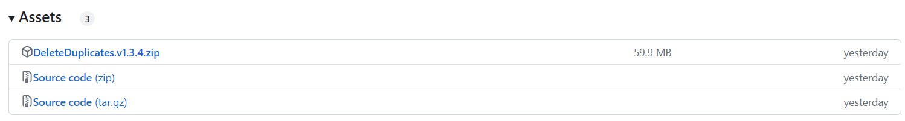
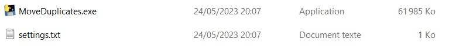
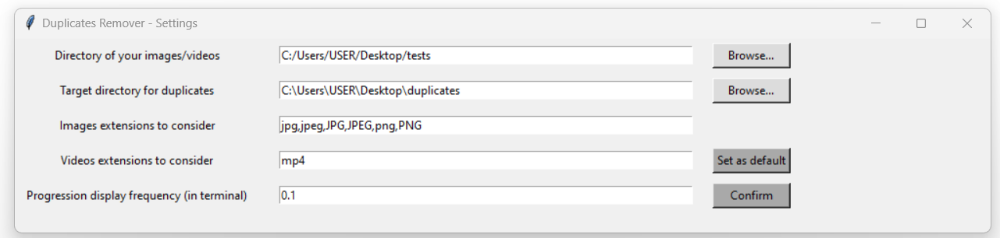
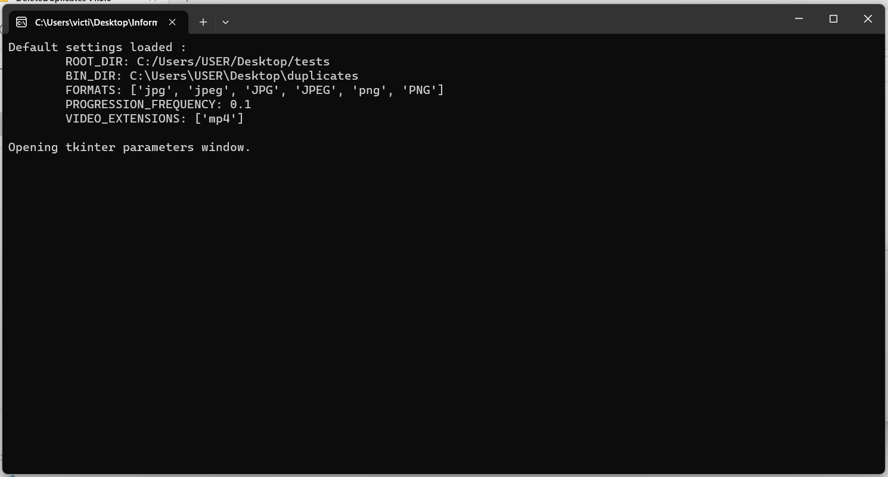
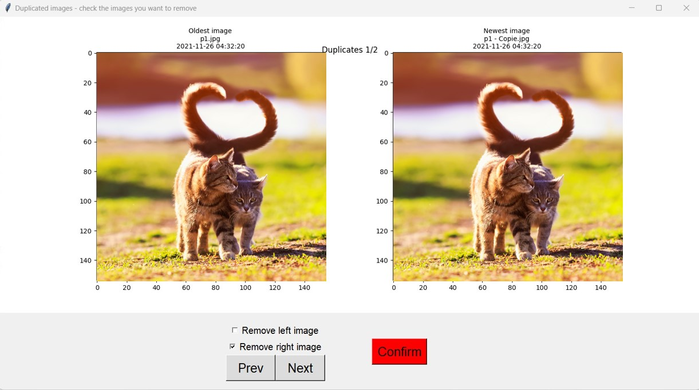

# Delete Duplicates

The aim of this program is to delete all the duplicated images and videos in a directory and its subdirectories.

## Developer manual

This program was coded using `Python3.7.9`.

### Install and run the program

Installation :

```bash
python -m venv venv
source venv/Scripts/activate
pip install -r requirements.txt
```
Run the program :

```bash
python MoveDuplicates.py
```

### Build executable

```bash
pyinstaller --onefile MoveDuplicates.py
```

Run executable without closing child process :

```bash
cmd.exe /k cmd /c MoveDuplicates.exe
```

## User manual

### How to download the program

Go here https://github.com/Alianidua/DeleteDuplicates/releases/latest and download the zip **DeleteDuplicates.version.zip**.



Extract the zip file. You should have the executable and the settings file :



### How does it work

The program works in 4 steps :

- First, list all the images in `ROOT_DIRECTORY`
- Second, compare the images and find the potential duplicates
- Then, show every potential duplicate and wait for user confirmation to move the files into `BIN_DIR`
- Last, move all duplicates to `BIN_DIR`

<ins>Note</ins>: for the moment the program is not able to efficiently detect images duplicated 3 or more times.
It must be runned multiple times to detect all duplicates properly.

### How to use this program

#### Before starting

You may need to disable your antivirus and/or run the executable as Administrator. I did this free, open source program for fun and for educational purposes. So I am not committed enough in this program to pay in order to whitelist it.

#### The settings window

When running the executable, it will open the settings windows and a CMD prompt :




Keep an eye on the terminal as it will show a lot of interesting information !

Here is the list of settings you have to specify :

- `ROOT_DIRECTORY` : folder where your potential duplicates are stored
- `BIN_DIRECTORY` : folder where you want to put the duplicates ; the directory should not exist or should be empty ; if leaved empty, the duplicates will not be moved
- `IMAGE_FORMATS` : comma-separated list of image extensions you want to detect
- `VIDEO_FORMATS` : comma-separated list of video extensions you want to detect
- `PROGRESSION_FREQUENCY`: how often you want the program to show its progression when it is comparing the files ; *0.01* means it will report its progression every 1%

You can click the button **Set as default** to register your configuration in your `settings.txt`. If you do so, the next time you run the program, it will load this configuration.

When you have modified the settings, you can click the **Confirm** button.

#### The validation window

The settings window will close. The program will find and compare all the images and videos in the specified folder. The comparaison algorithm is very simple, so it may result in false-positives.

When done, a new window will open :



The aim of this step is to allow you to review and choose which duplicates you want to remove : none, the left one, the right one or both.

Please, ensure you review all the potential duplicates before clicking the **Confirm** buttons.

#### The program ends

Once you have confirmed your selection, the images are moved into `BIN_DIRECTORY`.
